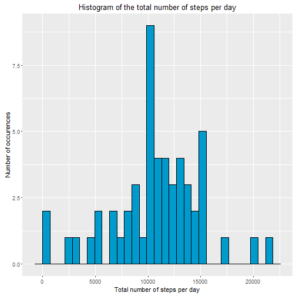
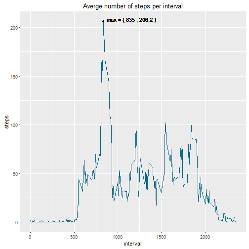
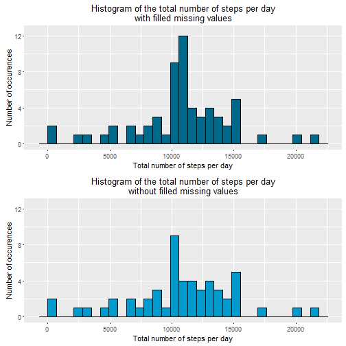
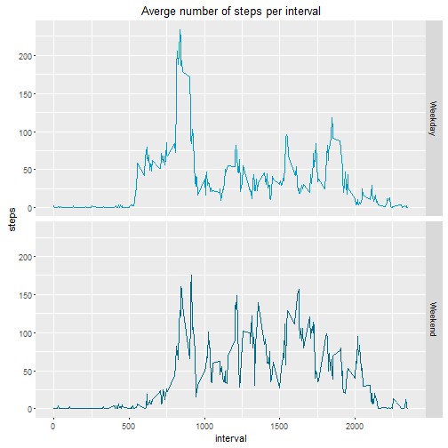

##Assignment 1

It is now possible to collect a large amount of data about personal movement using activity monitoring devices such as a Fitbit, Nike Fuelband, or Jawbone Up. These type of devices are part of the "quantified self" movement - a group of enthusiasts who take measurements about themselves regularly to improve their health, to find patterns in their behavior, or because they are tech geeks. But these data remain under-utilized both because the raw data are hard to obtain and there is a lack of statistical methods and software for processing and interpreting the data.

This assignment makes use of data from a personal activity monitoring device. This device collects data at 5 minute intervals through out the day. The data consists of two months of data from an anonymous individual collected during the months of October and November, 2012 and include the number of steps taken in 5 minute intervals each day.

###Loading and preprocessing the data
The data for this assignment can be downloaded from the course web site:

Dataset: [Activity monitoring data [52K]](https://d396qusza40orc.cloudfront.net/repdata%2Fdata%2Factivity.zip)
The variables included in this dataset are:

- **steps**: Number of steps taking in a 5-minute interval (missing values are coded as NA)
- **date**: The date on which the measurement was taken in YYYY-MM-DD format
- **interval**: Identifier for the 5-minute interval in which measurement was taken

The dataset is stored in a comma-separated-value (CSV) file and there are a total of 17,568 observations in this dataset.


1. Load the data

```r
## Load the data and store it in a dataframe called df
df <- read.csv("activity.csv", header = TRUE)
```

2. Process/transform the data (if necessary) into a format suitable for your analysis


```r
## Store the sum of the steps summed per day in a new data frame called 'df_pd'
df_pd <- aggregate(steps ~ date, data = df , FUN = sum)

## Store the average number of the steps per interval in a new data frame called 'df_pi'
df_pi <- aggregate(steps ~ interval, data = df , FUN = mean)
```


###What is mean total number of steps taken per day?

1. Calculate the total number of steps taken per day

2. Make a histogram of the total number of steps taken each day.


```r
## To make sure we can use graphs using ggplot this will be loaded firstly:
library(ggplot2)

## Create the histogram
p <- qplot(na.omit(df_pd$steps), geom="histogram", color =I("black"), fill =I("deepskyblue3"))
p <- p + xlab("Total number of steps per day")
p <- p + ylab("Number of occurences")
p <- p + ggtitle("Histogram of the total number of steps per day")
p
```

 

3. Calculate and report the mean and median total number of steps taken per day

```r
mean(df_pd$steps, na.rm=TRUE)
```

```
## [1] 10766.19
```

```r
median(df_pd$steps, na.rm=TRUE)
```

```
## [1] 10765
```

###What is the average daily activity pattern?
1. Make a time series plot (i.e. type = "l") of the 5-minute interval (x-axis) and the average number of steps taken, averaged across all days (y-axis)

```r
## Initialize the plot with the averge number of steps per interval
p <- qplot(interval, steps, data = df_pi, geom="line",  color =I("deepskyblue4"))
p <- p + xlab("interval")
p <- p + ylab("steps")
p <- p + ggtitle("Averge number of steps per interval")
```

2. Which 5-minute interval, on average across all the days in the dataset, contains the maximum number of steps?

```r
## x coordinate of maximum:
x <- df_pi[which.max(df_pi$steps),1]
## y coordinate of maximum:
y <- max(df_pi$steps)
label <- paste("max = (", x, ",", round(y,1), ")")

## Add this maximum to the plot
p <- p + geom_point(aes(x=x, y=y))
p <- p + geom_text(aes(x=x+40, y=y), label = label, hjust = 0, vjust = 0)
p
```

 


The interval that contains the maximum number of steps is:

```r
x
```

```
## [1] 835
```


###Imputing missing values
Note that there are a number of days/intervals where there are missing values (coded as NA). The presence of missing days may introduce bias into some calculations or summaries of the data.

1. Calculate and report the total number of missing values in the dataset (i.e. the total number of rows with NAs)

```r
sum(is.na(df$steps))
```

```
## [1] 2304
```

2. Devise a strategy for filling in all of the missing values in the dataset. The strategy does not need to be sophisticated. For example, you could use the mean/median for that day, or the mean for that 5-minute interval, etc.


```r
## To fill all the missing values in the dataset the strategy is chosen to 
## add the average number of steps per interval to the original dataframe
## by merging on the intervals
df$average_steps <- df_pi$steps[match(df_pi$interval, df$interval)]
## Create a function that will return the correct steps
replace_NA = function(x,y){
    if(is.na(x)){
        return(y)
    }
    return(x)
}
```

3. Create a new dataset that is equal to the original dataset but with the missing data filled in.

```r
## Put corrected steps values in a new column
df$cleaned_steps <- mapply(replace_NA,df$steps, df$average_steps)
```

4. Make a histogram of the total number of steps taken each day and Calculate and report the mean and median total number of steps taken per day. Do these values differ from the estimates from the first part of the assignment? What is the impact of imputing missing data on the estimates of the total daily number of steps?

```r
## Store the sum of the steps summed per day in a new data frame called 'df_pd_c'
df_pd_c <- aggregate(cleaned_steps ~ date, data = df , FUN = sum)

## Create the histogram
p1 <- qplot(na.omit(df_pd_c$cleaned_steps), geom="histogram", color =I("black"), fill =I("deepskyblue4"))
p1 <- p1 + xlab("Total number of steps per day")
p1 <- p1 + ylab("Number of occurences")
p1 <- p1 + ggtitle("Histogram of the total number of steps per day\nwith filled missing values")
p1 <- p1 + expand_limits(y=c(0,12.5))

## to be able to show two plots we load the grid(Extra package)
library(grid)
library(gridExtra)

p2 <- qplot(na.omit(df_pd$steps), geom="histogram", color =I("black"), fill =I("deepskyblue3")) 
p2 <- p2 + xlab("Total number of steps per day")
p2 <- p2 + ylab("Number of occurences")
p2 <- p2 + ggtitle("Histogram of the total number of steps per day\nwithout filled missing values")
p2 <- p2 + expand_limits(y=c(0,12.5))

grid.arrange(p1,p2, nrow =2)
```

 

```r
## Calculate the mean and median with the filled missing values
mean(df_pd_c$cleaned_steps, na.rm=TRUE)
```

```
## [1] 10766.19
```

```r
median(df_pd_c$cleaned_steps, na.rm=TRUE)
```

```
## [1] 10766.19
```

```r
## Calculate the mean and median without the filled missing values
mean(df_pd$steps, na.rm=TRUE)
```

```
## [1] 10766.19
```

```r
median(df_pd$steps, na.rm=TRUE)
```

```
## [1] 10765
```

Now that the missing values have been filled, the mean value is equal to the median.
It seems logical that these values should be closer together, since this we now have a lot more values closer to the mean in the dataset.

###Are there differences in activity patterns between weekdays and weekends?
For this part the weekdays() function may be of some help here. Use the dataset with the filled-in missing values for this part.

1. Create a new factor variable in the dataset with two levels -- "weekday" and "weekend" indicating whether a given date is a weekday or weekend day.

```r
## Adjust the date column to a date format
df$date <- as.POSIXct(df$date)

## Set system time to English so the name of the weekdays will be English
Sys.setlocale("LC_TIME", "English")
```

```
## [1] "English_United States.1252"
```

```r
##Save the weekdays in a new column
df$date <- as.POSIXct(df$date)
df$weekday <- weekdays(df$date)

## Create a function that will return either weekend or weekday
weekend_or_weekday = function(x){
    if(x == "Saturday" || x =="Sunday"){
        return("Weekend")
    }
    return("Weekday")
}
df$weekend_weekday <- as.factor(mapply(weekend_or_weekday,df$weekday))
## df$weekend_weekday <- factor(df$weekend_weekday )
```

2. Make a panel plot containing a time series plot (i.e. type = "l") of the 5-minute interval (x-axis) and the average number of steps taken, averaged across all weekday days or weekend days (y-axis). 

```r
## Store the average number of the steps per interval in a new data frame called 'df_pi_c'
df_pi_c <- aggregate(steps ~ interval + weekend_weekday, data = df , FUN = mean)

p <- qplot(interval, steps, color=weekend_weekday, data = df_pi_c, geom="line", show.legend=FALSE)
p <- p + facet_grid(facets =weekend_weekday~.)
p <- p + xlab("interval")
p <- p + ylab("steps")
p <- p + ggtitle("Averge number of steps per interval")
p <- p + scale_color_manual(values = c("deepskyblue3", "deepskyblue4"))
p
```

 
